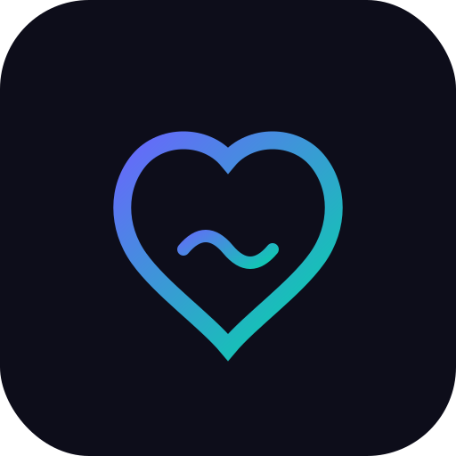

# 🏃 FitFlow

<p align="center">
  
</p>

<p align="center">
  <strong>Your Personal Wellness Journey</strong>
</p>

<p align="center">
  A modern, feature-rich Flutter application for fitness tracking and wellness management.
</p>

<p align="center">
  <a href="#features">Features</a> •
  <a href="#screenshots">Screenshots</a> •
  <a href="#installation">Installation</a> •
  <a href="#usage">Usage</a> •
  <a href="#architecture">Architecture</a> •
  <a href="#contributing">Contributing</a>
</p>

---

## ✨ Features

### 🔐 Authentication
- **Secure Login & Registration** with form validation
- **Admin Account**: Pre-configured admin access
- **In-Memory Database**: Offline user storage

### 🏋️ Workout Tracking
- **Workout Library**: Browse exercises by category (Yoga, HIIT, Strength, Core, Flexibility)
- **Workout Timer**: Built-in timer with pause/resume functionality
- **Detailed Instructions**: Step-by-step exercise guides

### 🍽️ Meal Planning
- **Meal Suggestions**: Healthy recipes for Breakfast, Lunch, Dinner, Snacks
- **Nutritional Info**: Calories, Protein, Carbs, Fat breakdown
- **Ingredient Lists**: Complete recipe ingredients

### ⚙️ Customization
- **Dark/Light Theme**: Toggle between themes
- **Arabic/English**: Full bilingual support with RTL layout
- **Push Notifications**: Workout reminders (configurable)

### 📊 Dashboard
- **Progress Tracking**: Steps, Calories, Active Minutes, Water intake
- **Daily Tips**: Wellness advice
- **Quick Actions**: Fast access to workouts and meals

---

## 📱 Screenshots

| Login | Dashboard | Workouts |
|:-----:|:---------:|:--------:|
| Dark themed login | Progress metrics | Exercise library |

| Meal Planner | Settings |
|:------------:|:--------:|
| Nutrition info | Theme & Language |

---

## 🚀 Installation

### Prerequisites
- Flutter SDK 3.5.0 or higher
- Dart SDK
- Android Studio / VS Code
- Android SDK 36+

### Setup

1. **Clone the repository**
```bash
git clone https://github.com/heshamalammar/FitFlow.git
cd FitFlow
```

2. **Install dependencies**
```bash
flutter pub get
```

3. **Run the app**
```bash
# On Android device
flutter run -d <device_id>

# On Chrome (Web)
flutter run -d chrome

# On Windows
flutter run -d windows
```

---

## 📖 Usage

### Admin Login
| Field | Value |
|-------|-------|
| Email | `admin@gmail.com` |
| Password | `admin123` |

### Creating an Account
1. Open the app
2. Tap "Sign Up"
3. Fill in your details
4. Start your wellness journey!

---

## 🏗️ Architecture

```
lib/
├── main.dart                 # App entry point
├── models/
│   ├── user_model.dart       # User data model
│   ├── workout_model.dart    # Workout data model
│   └── meal_model.dart       # Meal data model
├── providers/
│   ├── auth_provider.dart    # Authentication state
│   ├── theme_provider.dart   # Theme management
│   └── language_provider.dart # i18n support
├── services/
│   └── user_database_service.dart # In-memory DB
├── utils/
│   ├── constants.dart        # Colors, styles, dimensions
│   ├── validators.dart       # Form validation
│   ├── routes.dart           # Navigation routes
│   └── app_localizations.dart # Arabic/English strings
├── views/
│   ├── splash_screen.dart
│   ├── login_screen.dart
│   ├── signup_screen.dart
│   ├── home_screen.dart
│   ├── workout_library_screen.dart
│   ├── workout_details_screen.dart
│   ├── meal_planner_screen.dart
│   └── settings_screen.dart
└── widgets/
    ├── app_drawer.dart       # Navigation drawer
    ├── metric_card.dart      # Dashboard stats
    ├── workout_card.dart     # Workout list item
    └── custom_text_field.dart # Input field
```

---

## 🛠️ Tech Stack

| Technology | Purpose |
|------------|---------|
| **Flutter 3.38** | UI Framework |
| **Dart** | Programming Language |
| **Provider** | State Management |
| **Flutter Animate** | Animations |
| **Flutter Spinkit** | Loading indicators |
| **Material 3** | Design System |

---

## 🌐 Localization

FitFlow supports:
- 🇺🇸 **English** (default)
- 🇸🇦 **Arabic** (العربية) with RTL layout

Toggle language in **Settings → Appearance → Language**

---

## 🎨 Design

### Color Palette
| Color | Hex | Usage |
|-------|-----|-------|
| Primary | `#6C63FF` | Buttons, accents |
| Accent | `#00D9A5` | Success, highlights |
| Dark BG | `#0D0D1A` | Dark theme background |
| Light BG | `#F5F7FA` | Light theme background |

---

## 📄 License

This project is open source and available under the [MIT License](LICENSE).

---

## 👨‍💻 Developer

**Hesham Al-Ammar**

- 📧 Email: [hesham.a.alammar@gmail.com](mailto:hesham.a.alammar@gmail.com)
- 📱 Phone: +967 777 027 774
- 💼 LinkedIn: [linkedin.com/in/hesham-al-ammar](https://linkedin.com/in/hesham-al-ammar)

---

## 🤝 Contributing

Contributions are welcome! Please feel free to submit a Pull Request.

1. Fork the repository
2. Create your feature branch (`git checkout -b feature/AmazingFeature`)
3. Commit your changes (`git commit -m 'Add some AmazingFeature'`)
4. Push to the branch (`git push origin feature/AmazingFeature`)
5. Open a Pull Request

---

<p align="center">
  Made with ❤️ by Hesham Al-Ammar
</p>
